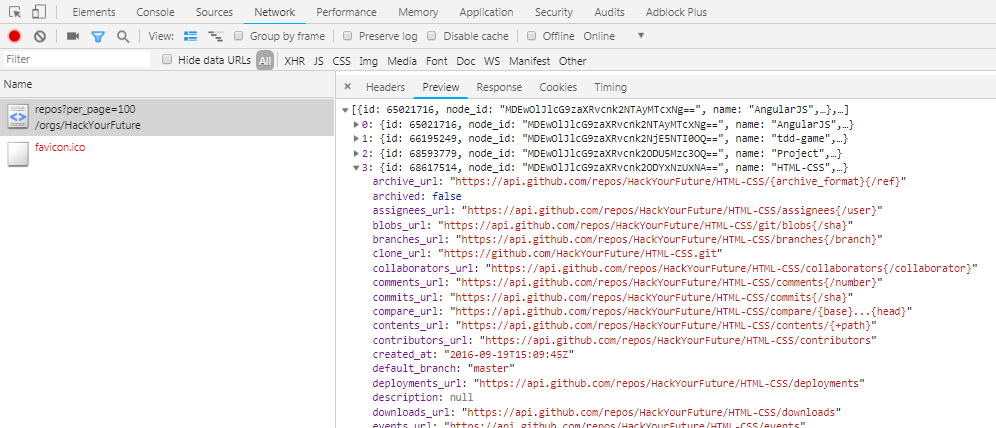
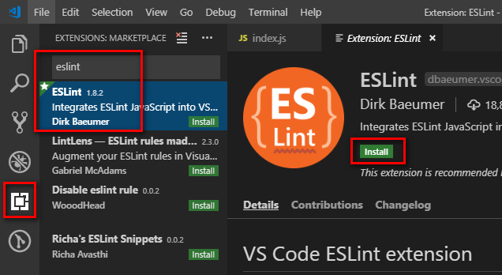
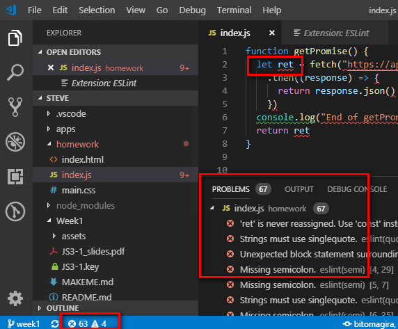
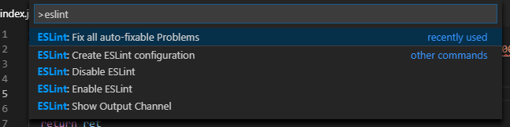
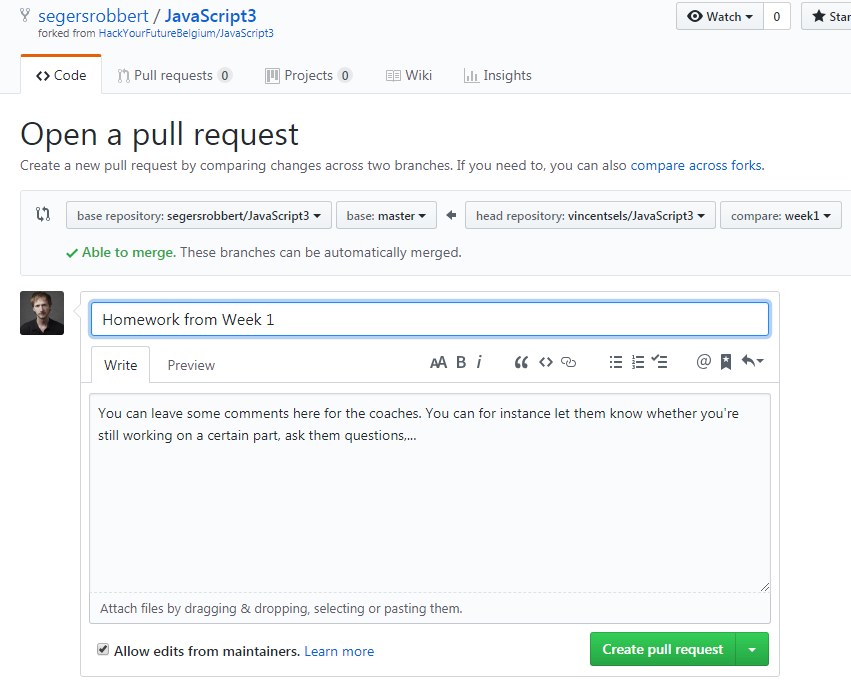

# Homework Week 1

## Building our first real web application

Yes! We're finally going to build our first actual web application! After completing this week's homework, you're officially a front-end web developer :nerd_face:. We'll start with the basics, and add more fancy stuff and rewrite parts as we learn more in the coming weeks.

Because we're actually going to build an entire application, this homework is more extensive and challenging. **Please read the instructions below carefully and follow them with great attention to detail**. This is also an important part of being a developer!

## The application: GitHub HYF Repo Browser

Over the coming weeks, we are going to write an application that uses the [GitHub API](https://developer.github.com/guides/getting-started/).

This application should display information about the available [HYF GitHub repositories](https://github.com/hackyourfuture). Eventually, it should have this functionality:

- The user should be able to select a repository from a list of available repositories.
- The application should display high-level information about the selected repository and show a list of its contributors.
- When clicking on the name of the selected repository the GitHub page for the corresponding repository should be opened in a new browser tab.
- When clicking on a contributor, the GitHub page for the contributor should be opened in a new browser tab.

The screenshot below shows an example of what your application could look like. It uses the [Material Design principles](https://material.io/design/). Note that this is just an example. If you find it boring or unimaginative, please improve on it! On the other hand, a simpler version is OK too, so long as you implement the expected functionality.


A live version of this application can be found here: http://hyf-github.netlify.com/

## The GitHub API

Aside from this GitHub web application that we all use, GitHub also exposes its content through an API, which any application can freely use. Let's have a look at it.

You can fetch a list of HYF repositories through this API endpoint ([What is an API Endpoint?](https://teamtreehouse.com/community/what-is-an-api-endpoint)):

```
https://api.github.com/orgs/HackYourFuture/repos?per_page=100
```

> Note the `?per_page=100` at the end of the above URL. That's a [query string](https://en.wikipedia.org/wiki/Query_string). In short, it *passes additional information to the API*, through its url, rather than through the request body. This particular query string tells the API we want to see `100` results `per_page`. The GitHub API [understands this](https://developer.github.com/v3/guides/traversing-with-pagination/#changing-the-number-of-items-received). We'll see query strings in more detail when we talk about REST later on in the course.

If you open this URL in the browser you will receive JSON data about the available HYF repositories. Try it now! You'll just see the JSON returned as text. That's a bit difficult to digest, isn't it? However, if you open the Developer Console (F12), and go to the 'Network' tab and hit refresh (F5), you'll get a neatly structured representation where you can 'browse' the result.



Still, this is lot of data, but don't be overwhelmed: you won't need 99% of it for this homework. The interesting properties are for instance `name`, `full_name` and `description`. There are also many properties that contain URLs, which can be used to navigate to detailed information about certain aspects of the repository. Go ahead and play around with them! One of these url's that you'll be using in this application, next week, is `contributors_url`: you can use the value of this property to fetch a list of contributors.

> As with most public API's, GitHub's API is very well and extensively documented. You can literally learn everything about it from just [reading their documentation](https://developer.github.com/guides/getting-started). However, API documentation can be daunting. For this homework it is not necessary to study the GitHub API documentation.

## Coding Style

Writing code is easy - writing [*clean code*](https://github.com/ryanmcdermott/clean-code-javascript) is hard. Books have been written about it. [Literally](https://www.bol.com/nl/f/clean/9200000033313462/?country=BE). Always remember that code is written once, but read dozens of times, including by you. Spare your future self a headache :weary:!

Clean code consists of proper naming, but also of more general 'styling'.

There are many ways we can 'style' our code - and there's an equal amount of [style guides](https://codeburst.io/5-javascript-style-guides-including-airbnb-github-google-88cbc6b2b7aa). Certain aspects are certainly debatable, however, over the years, there has been quite some consensus about many things. In the JavaScript world, the most widely used style guide - which you'll find used in many public repositories on GitHub and which you'll encounter in many companies - is the one from the Airbnb team (it has 82000 stars, making it one of GitHub's most popular repo's ever). That's the one we'll also be using during the course of HYF.

Here it is: the [Airbnb JavaScript Style Guide](https://github.com/airbnb/javascript).

While you do not need to read this guide in detail, it is recommended that you review sections 1-8, 12-13, 15-21 and 23.

Luckily, however, we can set-up any modern editor, including (especially) VS Code (:heart_eyes:), to help us follow these rules, highlighting warnings and errors. We'll run through how to set that up later in this guide. An additional check will be done right before you submit your homework as a pull request on GitHub.

## Homework schedule

You will be working on the same application during the next three weeks. For each week you will need to create a new Git branch, as listed in the Table 1 below.

| Week | Branch  | Assignment |
| ---- | ------- | ---------- |
|  1   | `week1` | - Part 1 & 2, by Wednesday: Setup environment, fetch the HYF repositories and log their display names to the console.<br/>- Part 3, by Friday: Populate a `<select>` list with the repository names; allow the user to pick one, and display some of its details, like in the example. |
|  2   | `week2` | Based on the `week1` branch:<br>- When a repository is selected, also load the contributors. Display a loading indicator while loading.<br>- Style the UI, and make it responsive.|
|  3   | `week3` | Based on the `week2` branch:<br>- Refactor the application to use ES6 Classes and async/await.<br>- Make the app ARIA-compliant.<br />- Marvel at your first application. |

# Instructions

## Part 1 - <small>Set-up your environment</small>
**Deadline: Wednesday evening**

- [ ] [Fork](https://help.github.com/en/articles/fork-a-repo) our class' fork of the JavaScript3 repository to your own GitHub account. Yes, you'll be creating a fork of a fork of a fork:

  ```
  - Main HYF Javascript 3 repository: https://github.com/HackYourFuture/JavaScript3
    - Belgium HYF fork: https://github.com/HackYourFutureBelgium/JavaScript3
      - Our class' (Rob's) fork: https://github.com/segersrobbert/JavaScript3
        - Your fork here.
  ```

  > *Reminder*: A fork is like your own copy of a repository, under your own account, of someone else's repository. Read everything about forking and being social on GitHub [here](https://help.github.com/en/articles/fork-a-repo).
  >
  > We use forks so that you can later on create [Pull Requests](https://help.github.com/en/articles/about-pull-requests). In short, a pull request (PR) is a way to ask the original owner of a repository (where you forked off from) to merge a change that you did on a branch of your local repository, into the original repository.
  >
  > A big advantage of PR's is that it allows to **compare code** and **give feedback** directly on the code! This is very handy when reviewing homework!

- [ ] [Clone](https://help.github.com/en/articles/fork-a-repo#step-2-create-a-local-clone-of-your-fork) the fork to your laptop.

- [ ] Open the newly created `JavaScript3` folder from the cloned repository in VS Code *(always open this entire main folder!)*
  
  > *Tip*: a command line, you can open a folder in VS Code by typing:
  >
  > ```
  > code .
  > ```

- [ ] Open a Terminal window in VS Code or in your favorite terminal (like [cmder](https://cmder.net/) or [mingw32](https://gitforwindows.org/)), and **from the main `JavaScript3` folder**, type the following command to install the airbnb style guide and ESLint tools as required for the homework:

  ```
  npm install
  ```
  
  This should output something like this. If not, contact your coach on Slack!

  ```
  $ npm install
  npm WARN hyf-js3-homework@1.0.0 No repository field.

  added 188 packages in 19.38s
  ```

- [ ] Create a new branch for the week 1 homework with the following command:

  ```
  git checkout -b week1
  ```
   
- [ ] Install the [**ESLint**](https://eslint.org/) extension in VS Code. This extension will highlight and inform you of any violations of the style guide, and allow you to auto-fix a lot of issues. You should probably also already install the [**EditorConfig for VS Code**](https://editorconfig.org/) plugin. Although it's not required in our case because we all use the same editor, it will come in handy when you work on public projects in the future.

  **Installing ESLint**:

  

  **Inspecting issues**: Your errors will be highlighted in the editor, and you get an overview in the 'Problems' window; which you access by clicking the little icon in the bottom-left corner. Selecting an error from this list naviates directly to it.

  

  **Auto-fix issues**: Press `ctrl+shift+p`, type `eslint` and choose 'Fix all auto-fixable Problems'. You may have to do this a few times.

  

## Part 2 - <small>Call the API</small>
**Deadline: Wednesday evening**

You'll create your application inside the `homework` subfolder of the main `JavaScript3` folder. It already contains 3 basic, but completely empty files: an html, a css and an javascript file.

- [ ] Your first task is to create the basic content for these files. Reference the css and javascript files in the correct way. Give your application a nice title and header.

- [ ] Write the javascript code that, as soon as the page loads, fetches the HYF repositories.

  > *Hints*:
  > - How do you execute code as soon as the page loads?
  > - How do we handle the *response* of an API call?
  > - How do we then *interpret* the JSON body of the response?

- [ ] Log the names of the returned repositories to the console; one next to the other.

  > *Hint*: map.

- [ ] Hand in this first part of your homework. See at the end of this guide for instructions.

## Part 3 - <small>Select list, repo details</small>
**Deadline: Friday evening**

- [ ] As in the example, in your application's header, create and populate a `<select>` list with all the repository's names.

  > *Hint*: map again.

- [ ] When the user selects a repository, display its details, nicely formatted. Display at least its name, a description, its number of forks, and when it was last updated, nicely formatted. Bonus points for nice icons. Even more bonus points for a conditional, dynamic nice icon for one of its properties, like `has_wiki`. Or be even more creative. Everything's possible.

  > *Hints*:
  > - In what *scope* will you have to declare the result of the call, so that you can access it later on?
  > - How do you handle a user selecting a value in the `<select>` list?
  > - How will you find the selected repository in the complete array? Hints: option value, filter
  > - How to convert a [ISO 8601](https://nl.wikipedia.org/wiki/ISO_8601) date string into a JavaScript `Date` (we haven't seen this yet, so Google!), and then format it as a human-readable *locale date string* and *locale time string*?

  > We know: creating HTML and modifying the DOM 'manually' is tedious and cumbersome. Later on in your HYF journey, in the [React module](https://github.com/HackYourFuture/React), you'll be modifying the DOM in a much easier and more fun way!

- [ ] That's it for now, time to hand in again!

# Handing in your homework

If necessary, review the instructions how to [Hand in homework](https://github.com/HackYourFuture/fundamentals/blob/master/fundamentals/homework_pr.md) using GitHub pull request.

To test whether your code will be accepted when you submit your homework as a pull request you need to ensure that it does not contain ESLint errors. Open a terminal window in VS Code (or elsewhere) in the main JavaScript3 directory and type the following command:

```
npm test
```

If any errors or warnings are reported by this command you need to fix them before submitting a pull request.

In addition, check for the following:

- Have you removed all commented out code (should never be present in a PR)?
- Do the variable, function and argument names you created follow the [Naming Conventions](../../../../fundamentals/blob/master/fundamentals/naming_conventions.md)?
- Is your code well-formatted (see [Code Formatting](../../../../fundamentals/blob/master/fundamentals/code_formatting.md))?

If the answer is 'yes' to the preceding questions you are ready to follow these instructions:

- [ ] Push your `week1` branch to GitHub:

  ```
  git push -u origin week1
  ```

  This will give you a link that you can follow to immediately create a pull request (see next step).

- [ ] Create a pull request (PR) for your `week1` branch against our class' (Rob's) fork `master` branch.

  

  > *Heads up!* Pay close attention to the values in the dropdown lists! Be sure to select `segersrobbert/JavaScript3` as the 'base repository', `master` as the 'base branch', and on the right-hand side, select your fork as the 'head repository' and `week1` (or whatever your homework branch is called) as the 'compare' branch.

- [ ] Keep an eye on your notifications: if there are issues with your homework, your coach will add comments to your PR. If they don't add comments, that means you've done an excellent job - or they dind't find the time to review it :(.

  Note that of course the coach will never actually *merge* your PR.

- [ ] You can always amend your homework by pushing more commits to your branch - they'll be included in the pull request automatically, and your coach will be notified. Do this to resolve any remarks your coach gave in the comments!
