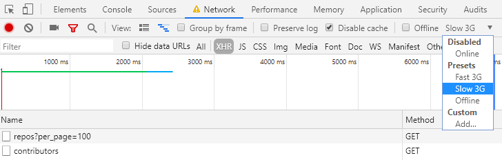
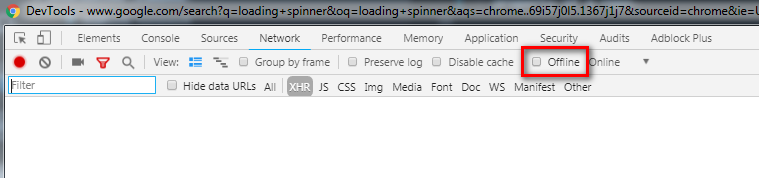

# Homework Week 2

## Part 1 <small>- Reading material</small>

- [ ] Read this article on scopes & closures: [Explaining javascript scope and closures](https://robertnyman.com/2008/10/09/explaining-javascript-scope-and-closures/)

- [ ] If you are still not completely clear on promises, here are some additional resources:

  - [Google's post about Promises](https://developers.google.com/web/fundamentals/getting-started/primers/promises)
  - [A nice article from David Walsh](https://davidwalsh.name/promises)
  - [A real life example](https://github.com/mdn/js-examples/blob/master/promises-test/index.html)
  - [stackoverflow](http://stackoverflow.com/questions/13343340/calling-an-asynchronous-function-within-a-for-loop-in-javascript)
  - YouTube: [promises](https://www.youtube.com/watch?v=WBupia9oidU)

## Part 2 <small>- Finish last week's homework</small>
**Deadline: Tuesday evening**

This week's homework builds upon last week's homework. So if you haven't already, finish last week's homework first, by following the [complete guide](../week1/MAKEME.md), step-by-step. If you want some intermediate comments/review after finishing that, go a head and already send it in with a pull request, as described there. Or you may immediately add this week's work.

## Part 3 <small>- Setup for this week</small>
**Deadline: Thursday evening**

Create a new branch based on the `week1` branch:

- [ ] Make sure that you committed all changes in the week 1 version of your homework.
- [ ] Create a new `week2` branch:

   ```
   git checkout -b week2
   ```

## Part 4 <small>- This week's assignment</small>
**Deadline: Tursday evening**

You will continue to work on the files `index.js` and (possibly) `main.css`.

- [ ] Upon selecting a repository, also load that repository's list of **contributers**, and display it, at least using the contributor's profile picture, name, and amout of repositories.
  > *Hint*: As we saw last week, the link to the repo's contributors is a property of a repo.

- [ ] Clicking on the user should open this user's GitHub home page in a new tab.
  > *Hint*: `target`

- [ ] When loading the repositories initially, and when loading the contributors after selecting a repo: display a 'loading' text or 'spinner'. Remove it once the data is loaded and displayed (or when an error occurs).
  > *Hint*: In Chrome DevTools, in the Network tab, you can simulate a 'Slow 3G' connection to test your loading text/spinner.
  > 

- [ ] When any error occurs - either when [fetching](https://developer.mozilla.org/en-US/docs/Web/API/Fetch_API) the repos or when loading contributers, clearly display a nice error message somewhere on the page.
  > *Hints*:
  >
  >- `fetch` will not `reject` on a 404; not even on a 500; it will actually *succeed* (resolve). You have to check the result's `status` to see whether its response has a statuscode in the 200-range.
  >
  >   Give it a try - this will actually log the success!
  >
  >   ```
  >   fetch('this-isnt-even-a-proper-url')
  >     .then((resp) => console.log('success', resp))
  >     .catch((err) => console.error('error', err));
  >   ```
  >   `fetch` will only *reject* when there is really a network error, like when you're offline.
  >- You can re-use a function you pass as callback to `then`!
  >- Test this by changing your fetch urls, and by simulating having no internet. You can do this in DevTools, in the Network tab:
  >  

- [ ] If not yet completed in week 1, make your app responsive. Use CSS media queries and [Flexbox](https://css-tricks.com/snippets/css/a-guide-to-flexbox/)).

## Part 5 <small>- Handing in your homework</small>
**Deadline: Thursday evening**

If necessary, review the instructions how to [Hand in homework](https://github.com/HackYourFuture/fundamentals/blob/master/fundamentals/homework_pr.md) using GitHub pull request.

To test whether your code will be accepted when you submit your homework as a pull request you need to ensure that it does not contain ESLinr errors. Open a terminal window in VSCode and type the following command:

```
npm test
```

If any errors or warnings are reported by this command you need to fix them before submitting a pull request.

In addition, check for the following:

- Have you removed all commented out code (should never be present in a PR)?
- Do the variable, function and argument names you created follow the [Naming Conventions](../../../../fundamentals/blob/master/fundamentals/naming_conventions.md)?
- Is your code well-formatted (see [Code Formatting](../../../../fundamentals/blob/master/fundamentals/code_formatting.md))?

If the answer is 'yes' to the preceding questions you are ready to follow these instructions:

1. Push your `week2` branch to GitHub:

   ```
   git push -u origin week2
   ```

2. Create a pull request for your `week2` branch.

Note:

1. Please remove all redundant, commented-out code and console.log's from your files before pushing your homework as finished. There is no need for your mentors to review this stuff.
2. Please make sure your code is well-formatted and follows the recommended naming conventions.